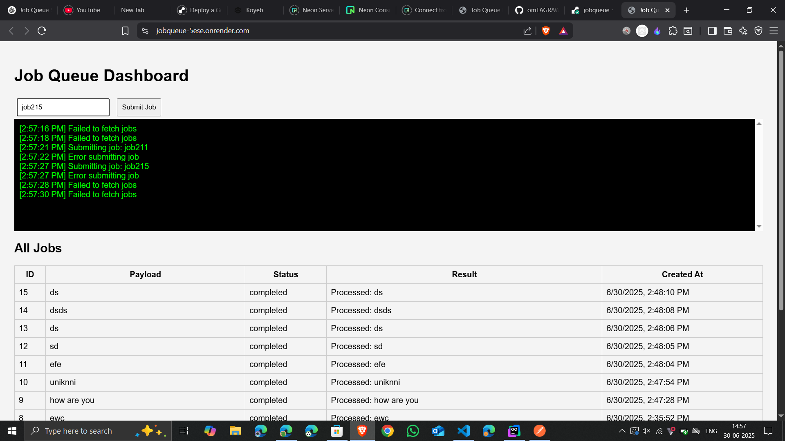

# JobQueue System in Go

A high-performance, concurrent job queue system built with **Go**, **PostgreSQL**, and **Gin**, featuring:

* 🚀 Job submission, tracking, and result APIs
* 🛠️ Goroutine-based worker pool with concurrency support
* 📦 PostgreSQL storage (hosted via [Neon](https://neon.tech))
* 🖥️ Minimal live HTML UI for job interaction
* 🔧 Structured logging via Logrus
* 🌐 Deployed live on Render

---

## 🔗 Live Demo

* 🔥 Web UI: [https://jobqueue-5ese.onrender.com](https://jobqueue-5ese.onrender.com)
* 🧠 GitHub Repo: [github.com/omEAGRAWAL/jobqueue](https://github.com/omEAGRAWAL/jobqueue)

---


## 📁 Project Structure

```
jobqueue/
├── cmd/               # Entry point
│   └── main.go
├── config/            # DB connection logic
├── service/           # Job APIs and worker logic
├── model/             # Job model
├── index.html            # index.html UI
├── go.mod / go.sum
├── render.yaml        # Render deployment config
└── README.md
```

---

## 🚀 Features

* **RESTful APIs** for job submission, status, and listing
* **Worker Pool** with goroutines for concurrent job execution
* **Database-backed** persistence (PostgreSQL)
* **Live HTML UI** with form + log console
* **Structured logs** for traceability

---

## 🔧 API Endpoints

| Method | Endpoint    | Description               |
| ------ | ----------- | ------------------------- |
| POST   | `/jobs`     | Submit a new job          |
| GET    | `/jobs/:id` | Get job by ID             |
| GET    | `/jobs`     | List all jobs (paginated) |

### Example Request (POST /jobs)

```json
{
  "payload": "Example task"
}
```

---

## 🖥️ HTML UI (index.html)

* Submit jobs from a form
* Auto-refreshes job status every 3 seconds
* Console-style live logs for feedback

Access via root: `https://jobqueue-5ese.onrender.com/`

---

## 🏗️ How It Works

* Submitted jobs are saved in the `jobs` table with `status = 'pending'`
* A worker pool picks up pending jobs from DB and processes them concurrently
* Upon processing, the job status is updated and result saved

---

## 🛠️ How to Run Locally

### 1. Clone the Repo

```bash
git clone https://github.com/omEAGRAWAL/jobqueue.git
cd jobqueue
```

### 2. Set Up DB Connection

Update `.env` or set environment variable:

```env
DATABASE_URL="your_postgres_connection_string"
```

### 3. Run

```bash
go run cmd/main.go
```

Open: `http://localhost:8081`

---

## 🧪 Test With Postman

* **Submit Job:** `POST http://localhost:8081/jobs`
* **Get Job:** `GET http://localhost:8081/jobs/1`
* **List Jobs:** `GET http://localhost:8081/jobs`

Body example:

```json
{ "payload": "do this" }
```

---

## 🚀 Deployment on Render

* Uses `render.yaml` for config
* Set environment variable `DATABASE_URL` in Render dashboard
* Build Command: `go build -o main ./cmd/main.go`
* Start Command: `./main`

---

## 📦 Future Improvements

* Add job retry mechanism
* WebSocket-based real-time logs
* Authentication for admin UI
* Metrics dashboard (e.g., Prometheus + Grafana)

---

## 👨‍💻 Author

Made with ❤️ by [Om Agrawal](https://github.com/omEAGRAWAL)

---

## 📝 License

MIT License. See `LICENSE` file.
